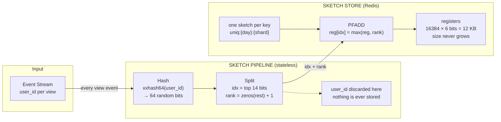
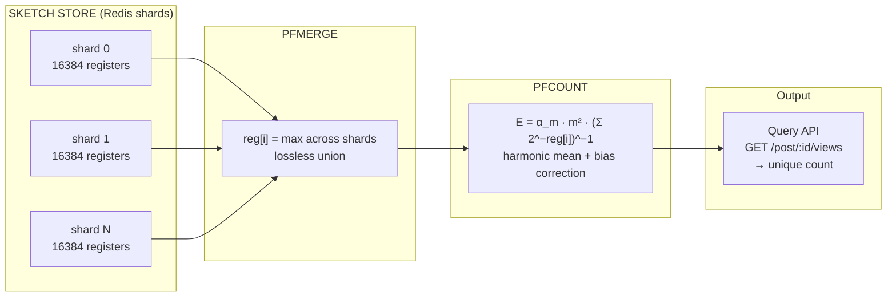

# Reddit Views Counter. HyperLogLog — A Billion Uniques in 12 KB

## Real-World Usage
- **Reddit** — unique view counts on posts
- **Google BigQuery** — `APPROX_COUNT_DISTINCT()` uses HLL internally
- **Amazon Redshift** — `APPROXIMATE COUNT(DISTINCT ...)`
- **Presto/Trino** — `approx_distinct()` function
- **Druid** — built-in HLL aggregator for real-time analytics

## Problem Statement

Reddit shows a view count on every post. Behind that single number sit two hard problems at scale:

**1. Storage — how do we remember who already visited?**
To count *unique* viewers we need to know whether a given user has already been counted. The naive answer is a Set of user IDs per post. At Reddit's scale — millions of posts, each potentially seen by hundreds of millions of users — that set explodes: 1 billion unique viewers × 8 bytes per ID = **~8 GB for a single post**. Multiply by millions of active posts and the storage bill becomes absurd.

**2. Computation — how do we count the uniques efficiently?**
Even if we could afford the storage, computing `COUNT(DISTINCT user_id)` over billions of rows is expensive. Every read request would scan or sort a massive dataset. The operation must be **O(1)** at query time, not O(n), to serve the count on every page load.

Any viable solution must solve both problems simultaneously: keep memory bounded regardless of cardinality, and make the count cheap to compute.

## Approaches

Two columns in the table below need context:
- **Membership query** — can you ask "did user X already view this post?" Needed if you want to suppress duplicate UI events or gate access, but *not* required just to display a unique count.
- **Mergeable** — can you combine counters from multiple shards/time windows into one without re-processing raw events? At Reddit's scale the event stream is partitioned across many machines, so the per-shard sketches must merge cheaply to produce a global count.

| # | Approach | Storage (1B uniques) | Count cost | Membership query? | Mergeable? | Drawback |
|---|----------|---------------------|------------|-------------------|------------|----------|
| 1 | **HashSet / DB table** | ~8 GB | O(n) scan or maintained counter | ✅ Yes | ❌ Expensive (set union) | Unbounded memory, slow at scale |
| 2 | **Bitmap** | ~125 MB (if IDs are dense) | O(1) popcount | ✅ Yes | ✅ Bitwise OR | Requires dense, bounded ID space; wastes memory when IDs are sparse |
| 3 | **Bloom Filter** | ~1.2 GB (1% FP rate) | ❌ No cardinality estimate | ✅ Approximate (false positives) | ✅ Bitwise OR | Answers "seen before?" not "how many unique?" — wrong primitive for counting |
| 4 | **HyperLogLog (HLL)** | **12 KB** | **O(1)** | ❌ No | ✅ Lossless (`max` per register) | ~0.81% standard error; no membership or element retrieval |

**1. HashSet / DB table** — store every `user_id` in a set or database row per post; exact but memory grows linearly with audience size.

**2. Bitmap** — allocate one bit per possible user ID; fast and exact, but only practical when IDs are dense integers within a known range.

**3. Bloom Filter** — a probabilistic set that can tell you "maybe seen" or "definitely not seen," but has no way to output a cardinality estimate.

**4. HyperLogLog (HLL)** — a probabilistic cardinality estimator that compresses any number of unique elements into a fixed 12 KB sketch, trades ~0.81% accuracy for a million-fold memory reduction, and merges losslessly across shards.

**Options 1–2** give exact answers but don't scale in memory.
**Option 3** is space-efficient but answers the wrong question — it tells you *if* a user was seen, not *how many* unique users there are.
**Option 4 (HyperLogLog)** directly answers "how many unique?" in fixed 12 KB with O(1) add and count, and merges losslessly across shards — making it the standard choice for this class of problem.

## Architecture Overview

### Write Path — Unique Visitor Registration

Every time a user opens a post, the event enters the write path. The user ID is hashed, split into a bucket index and rank, and the register is updated. The original user ID is discarded — nothing is stored beyond the 12 KB sketch.



### Read Path — Views Calculation

A single Redis instance cannot absorb the full write throughput of a viral post (millions of PFADD commands per second), so the write path partitions events across multiple shards — each shard independently maintains its own 12 KB HLL sketch for a subset of incoming events. No shard sees all the traffic, which is exactly the point.

When the API needs to serve "X unique views," it merges these per-shard sketches into one. The merge is lossless: for each of the 16,384 registers, take the max value across all shards. A user hashes to the same bucket index regardless of which shard recorded them, so `max` preserves the highest rank seen anywhere — the merged sketch is identical to one that had processed every event itself. The harmonic-mean estimator with bias correction then produces the count.



## How It Works Step by Step

### Step 1: Hash the user_id
Each incoming `user_id` is hashed using `xxhash64`, producing **64 uniformly random bits**.

```
user_id: "alex_123"  →  xxhash64  →  0110 0010 1101 0001 ... (64 bits)
```

**Why xxhash64?** It's extremely fast (non-cryptographic) and produces well-distributed output — both critical for high-throughput event streams.

### Step 2: Split the hash into index + rank

The 64-bit hash is split into two parts:
- **Top 14 bits** → `idx` — selects one of **2^14 = 16,384 registers** (buckets)
- **Remaining 50 bits** → count leading zeros + 1 = `rank`

```
Hash:    01100010 11010001 ...
         ^^^^^^^^^^^^^^                    ^^^^^^^^^^^^^^^^^^^^^^^^^^...
         top 14 bits = idx (bucket #)      remaining 50 bits → rank
```

**The rank is the key insight.** Seeing more leading zeros is exponentially less likely — like flipping a coin and getting 10 heads in a row. If the maximum rank in a bucket is high, many distinct values must have passed through it.

### Step 3: Update the register (PFADD)

Each register stores only the **maximum rank** ever seen:

```
reg[idx] = max(reg[idx], rank)
```

The user_id is **discarded after hashing** — nothing is ever stored. The entire state is 16,384 registers × 6 bits each = **12 KB fixed**.

### Step 4: Estimate cardinality (PFCOUNT)

The harmonic mean of all registers, with a bias correction factor, produces the estimate:

```
E = α_m * m^2 * (Σ 2^(-reg[i]))^(-1)

where:
  m = 16,384 (number of registers)
  α_m = bias correction constant ≈ 0.7213 / (1 + 1.079/m)
  reg[i] = value of register i
```

Standard error: **1.04 / √m ≈ 0.81%** for m = 16,384.

## Redis Implementation

Redis has HyperLogLog built-in via `PFADD` and `PFCOUNT` commands (the "PF" stands for **Philippe Flajolet**, inventor of the algorithm).

```
# Add user views to a post's HLL
PFADD post:12345:views user_42
PFADD post:12345:views user_99
PFADD post:12345:views user_42   # duplicate — won't change the count

# Get estimated unique views
PFCOUNT post:12345:views
# → (integer) 2
```

### Sharding Strategy for Scale

```
# Shard key pattern
uniq:{day}:{shard}

# Write to shards independently (no coordination needed)
PFADD uniq:2025-01-15:shard0 user_42
PFADD uniq:2025-01-15:shard1 user_99

# Merge shards for global count — lossless union via max per register
PFMERGE uniq:2025-01-15:global uniq:2025-01-15:shard0 uniq:2025-01-15:shard1
PFCOUNT uniq:2025-01-15:global
```

## Why This Architecture Scales

| Property | Benefit |
| --- | --- |
| **Fixed 12 KB per sketch** | Each shard's sketch is 12 KB whether it has counted 100 or 1 billion unique items. With S shards the total storage is S × 12 KB — still trivial (e.g. 10 shards = 120 KB). At query time PFMERGE reads all S sketches into memory to produce one merged sketch, so the merge footprint is also S × 12 KB — negligible compared to storing raw user IDs |
| **Stateless pipeline** | Hash + Split needs zero memory, no lookups, no coordination — pure computation |
| **Lossless merges** | `reg[i] = max across shards` — union is trivially parallelizable. The merged sketch is identical to one that processed every event itself |
| **No stored user data** | user_id is discarded after hashing — privacy-friendly |
| **O(1) add and count** | Constant time per operation regardless of cardinality |
| **Built into Redis** | `PFADD`, `PFCOUNT`, `PFMERGE` — no custom code needed |

## Memory Comparison

| Approach | Memory for 1B unique users | Error |
| --- | --- | --- |
| HashSet (exact) | ~8 GB | 0% |
| Bitmap (if IDs are dense) | ~125 MB | 0% |
| **HyperLogLog** | **12 KB** | **~0.81%** |
| HyperLogLog (sparse mode) | ~200 bytes (small sets) | ~0.81% |

## Trade-offs and Limitations

**What you CAN ask:**
- "How many unique viewers saw this post?" → ✅ ~0.81% error

**What you CANNOT ask:**
- "Did user_42 view this post?" → ❌ No membership queries
- "Give me the list of all viewers" → ❌ No element retrieval

HLL is a **write-only, append-only, estimate-only** structure.

## Related Probabilistic Data Structures

| Structure | Question it answers | Use case |
| --- | --- | --- |
| **HyperLogLog** | "How many unique?" | Unique views, visitors, IPs |
| **Bloom Filter** | "Have I seen this before?" (may false-positive) | Deduplication, cache lookup |
| **Count-Min Sketch** | "How many times did I see X?" | Frequency estimation, trending |
| **Top-K / Heavy Hitters** | "What are the most frequent items?" | Trending topics, popular posts |

## Changelog

| When | What changed | By whom |
|------|-------------|---------|
| 2025-08-25 | Initial draft: problem statement, approaches comparison, HLL deep-dive, architecture diagrams | Aleksei Kolesnikov |
